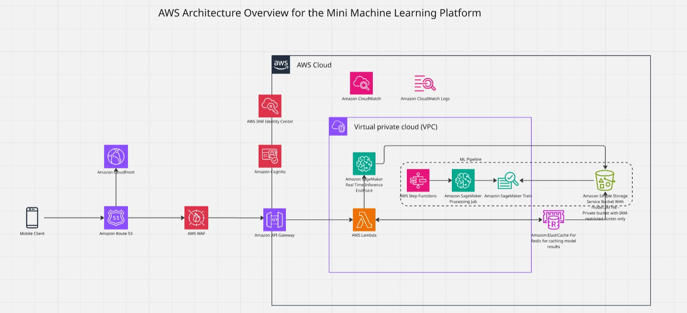

# AWS Architecture Overview – Mini Machine Learning Platform

## Overview

The proposed architecture meets the requirements of **reliability**, **scalability**, and **cost-efficiency** by delivering a modern, secure, and serverless solution for both model inference and training.

With a complete flow—from user authentication to real-time inference, automated training, and result caching—the solution ensures high availability, low operational cost, and protection of sensitive data through AWS-managed services.

The architecture integrates strong security practices, including:

- JWT tokens issued by Amazon Cognito and validated via API Gateway  
- Encryption at rest and in transit using AWS KMS and TLS  
- Federated authentication and fine-grained access control through IAM  
- Resource isolation in private subnets  
- Controlled and protected caching to ensure data integrity, confidentiality, and compliance with security best practices  

---

## Reliability

- **Amazon Cognito** authenticates users and issues JWT tokens with scoped permissions  
- **JWT tokens** are validated in real-time, enforcing secure and controlled access  
- **API Gateway** combined with **AWS WAF** acts as the first layer of defense against attacks such as DDoS, SQL Injection, and unauthorized access  
- **Encryption**:  
  - Amazon S3 and ElastiCache are protected with **AWS KMS**  
  - All traffic between components is encrypted with **HTTPS/TLS**  
- **CloudWatch Logs and Metrics** provide full visibility into failures, latency, and usage patterns, with automated alerting  
- **Private S3 buckets**, accessible only via IAM policies, protect training data and model artifacts from leakage  
- **Step Functions** include automatic retries to ensure resilient execution of ML pipelines  

---

## Scalability

- **AWS Lambda** and **API Gateway** scale automatically based on demand with no pre-provisioning  
- **SageMaker Endpoints** allow dynamic scaling of inference capacity based on traffic  
- **Step Functions** orchestrate complex and reentrant workflows, enabling parallel processing and state management  
- **Amazon ElastiCache (Redis)** provides a high-performance prediction cache supporting thousands of simultaneous requests  
- **Decoupled architecture** using managed services promotes elasticity and natural load balancing  
- **VPC with public and private subnets** isolates critical resources and regulates ingress/egress traffic  

---

## Cost-Efficiency

- **Serverless architecture** (Lambda, API Gateway, Step Functions) avoids fixed infrastructure costs  
- **On-demand SageMaker** usage ensures resources are only consumed when necessary, avoiding idle compute charges  
- **Prediction caching with Redis** minimizes redundant calls to SageMaker, optimizing cost  
- **Amazon S3** provides low-cost, durable, and scalable storage for datasets and model versions  
- **Configurable retention in CloudWatch Logs** allows balancing observability needs with storage costs  
- **Pay-per-use billing model** across AWS services reduces unnecessary infrastructure expenditure  